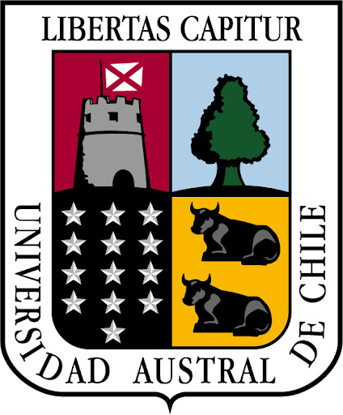

[English](README.md) | [Español](README.es.md)

# Humedat@ — Boya inteligente para monitoreo de calidad del agua en tiempo real y de bajo costo

> **Humedat@** es una innovación tecnológica nacida en Valdivia, Chile, e impulsada por el [Centro de Humedales Río Cruces (CEHUM)](https://cehum.org/) en colaboración con [LeufüLab](https://leufulab.cl/), ambos parte de la [Universidad Austral de Chile](https://www.uach.cl/). Está diseñada para el monitoreo remoto, continuo y en tiempo real de la calidad del agua en humedales y otros ecosistemas acuáticos.  

<p>
  
  
  
</p>


## Tabla de contenidos

- [¿Qué es Humedat@?](#qué-es-humedat)
- [Equipo del proyecto y colaboradores](#equipo-del-proyecto-y-colaboradores)
- [Financiamiento y apoyo](#financiamiento-y-apoyo)
- [Contenidos del repositorio](#contenidos-del-repositorio)
- [Cómo funciona el sistema](#cómo-funciona-el-sistema)
- [Descripción general del hardware](#descripción-general-del-hardware)
- [Funcionalidades del software](#funcionalidades-del-software)
  - [Aplicación web](#aplicación-web)
  - [Aplicación móvil](#aplicación-móvil)
- [Infraestructura de datos y nube](#infraestructura-de-datos-y-nube)
- [Primeros pasos](#primeros-pasos)
- [Contribuciones](#contribuciones)
- [Licencia](#licencia)

---

## ¿Qué es Humedat@?

Humedat@ es un sistema abierto y de bajo costo relativo para el monitoreo ambiental, nacido en Valdivia, Chile, y diseñado para registrar de manera continua la calidad del agua en humedales y otros ecosistemas acuáticos. Cada unidad Humedat@ está construido a partir de un barril de cerveza de acero inoxidable reutilizado, que contiene sensores, microcontroladores, sistemas de alimentación, almacenamiento local y módulos de comunicación inalámbrica.


El sistema registra variables ambientales —como temperatura del agua, pH, conductividad eléctrica, oxígeno disuelto y potencial de óxido-reducción— junto con indicadores internos del estado del dispositivo. Los datos se transmiten inalámbricamente desde terreno hacia almacenamiento en la nube y se ponen a disposición mediante interfaces web y móviles interactivas, en tiempo real.

Humedat@-software fue diseñado para escalar la plataforma. Por ejemplo, CEHUM puede desplegarla en múltiples organizaciones, cada una administrando su propia red de boyas agrupadas en **clusters**, por ejemplo, por proyecto o cliente, y **zonas** de medición, con una o más boyas por zona. Si una boya inteligente requiere mantención y es reemplazada, el Humedat@-software maneja la transición de manera semiautónoma, de modo que las series de datos se mantengan continuas.

El proyecto busca hacer que la tecnología de monitoreo ambiental sea más accesible para la investigación, la educación, la conservación y la gestión comunitaria de humedales.

---

## Equipo del proyecto y colaboradores

**Lider del proyecto**

- **Cristián Correa, PhD** — Biólogo Marino y Ecólogo — [cristiancorrea@gmail.com](mailto:cristiancorrea@gmail.com)

**Colaboradores técnicos principales**

- **Christian Santibáñez** — Ingeniero Eléctrico  
- **David Valencia** — Diseñador Industrial  
- **Ian Zamora** — Ingeniero Electrónico  
- **Kathrina Loyola** — Licenciada en Ciencias con mención Biología  
- **Matías Soto** — Ingeniero Informático  

---

## Financiamiento y apoyo

Este proyecto ha sido posible gracias al respaldo institucional y financiamiento del [Centro de Humedales Río Cruces (CEHUM)](https://cehum.org/), el [Proyecto de Conservación Habitable Isla San Francisco](https://tfertil.cl/proyecto/isla-san-francisco/), aportes de [Cerveza Kunstmann](https://www.cerveza-kunstmann.cl/) y la colaboración de [LeufüLab](https://leufulab.cl/). El prototipo actual de Humedat@-software fue desarrollado a través del curso IIC2154 — Proyecto de Especialidad 2024, de la Pontificia Universidad Católica de Chile, como parte del ecosistema más amplio de hardware y software de Humedat@.

---

## Contenidos del repositorio

Este repositorio contiene el código fuente y la documentación completa del sistema Humedat@:

| Carpeta | Descripción |
|---|---|
| `manual_humedata/` | **Manual técnico completo**: hardware, firmware, configuración en la nube y calibración |
| `Humedata-software/` | Aplicación web: frontend + backend, y aplicación móvil |
| `humedata_atlas/` | Firmware Arduino para boyas con sensores Atlas Scientific |
| `humedata_xian/` | Firmware Arduino para boyas con sensores Xi'an Desun |
| `TTN_payload_formatters/` | Decodificadores JavaScript para paquetes de datos LoRaWAN en The Things Network |
| `mqtt_subscriber/` | Servicio que recibe datos desde TTN y los escribe en la base de datos MySQL |
| `data_storage/` | Scripts de base de datos y definiciones de esquema |
| `printed_circuit_boards/` | Archivos de diseño PCB para la placa principal de Humedat@ |
| `handle_sensors_test/` | Código de prueba para módulos individuales de sensores |
| `humedata_testing/` | Scripts de pruebas de integración |
| `working_codes/` | Versiones estables o de referencia del firmware de los dispositivos |
| `xian_gps_debug/` | Utilidades de diagnóstico GPS |

---

## Cómo funciona el sistema

Los datos fluyen a través de varias capas, desde la boya inteligente hasta el navegador:

```text
Sensores → Arduino (MKR WAN 1300) → radio LoRaWAN → Gateway Dragino
    → The Things Network (TTN) → MQTT subscriber → base de datos MySQL
        → Backend API (AWS App Runner) → aplicación web / móvil
```
1. **En la boya inteligente:** un microcontrolador Arduino lee los sensores a intervalos configurables y empaqueta los datos en paquetes binarios compactos.
2. **Transmisión inalámbrica:** los datos se envían por radio LoRaWAN a un gateway Dragino, que los reenvía a The Things Network (TTN) a través de internet, ya sea por WiFi o mediante una tarjeta SIM celular.
3. **Ingesta en la nube:** un payload formatter en TTN decodifica los paquetes binarios y los transforma en valores legibles. Luego, un servicio MQTT subscriber escribe los datos en una base de datos MySQL alojada en OpenCloud.
4. **Visualización:** una aplicación web y una aplicación móvil complementaria permiten a los usuarios explorar e interactuar con los datos mediante mapas, gráficos de series de tiempo y descargas en formato CSV.

---

## Descripción general del hardware

Cada boya inteligente Humedat@ está construida en torno a:

- **PCBs personalizadas**, que alojan el Arduino MKR WAN 1300 y tienen puertos para sensores Atlas Scientific (I2C), sensores Xi'an (RS485), GPS y sensores ambientales internos.
- **Circuitos de alimentación basados en MOSFET**, para reinicios automáticos diarios, reinicios mediante interruptor magnético usando un imán desde el exterior del barril y manejo de energía del GPS para extender la autonomía de la batería.
- **Módulos Atlas Scientific EZO** o sensores **Xi'an Desun** para medición de calidad del agua (pH, oxígeno disuelto, conductividad, ORP y temperatura). 
- **Paneles solares y baterías** para operación autónoma.
- **Tarjeta SD** para respaldo local de datos en caso de pérdida de conectividad.
- **Gateway Dragino DLOS8N** para conectividad LoRaWAN, vía WiFi o tarjeta SIM celular.

Los archivos de diseño PCB están disponibles en la carpeta `printed_circuit_boards/`.

---

## Funcionalidades del software

El prototipo actual de Humedat@-software fue desarrollado a través del curso IIC2154 — Proyecto de Especialidad 2024, de la Pontificia Universidad Católica de Chile, como parte del ecosistema más amplio de hardware y software de Humedat@.

### Aplicación web

La plataforma web contempla cuatro roles de usuario con permisos progresivamente más amplios:

- **Visitantes:** pueden explorar mapas y visualizar gráficos de series de tiempo de sensores sin iniciar sesión.
- **Usuarios comunes:** usuarios con cuenta que, además, pueden descargar datos en formato CSV.
- **Administradores:** pueden anotar series de tiempo, enmascarar o desenmascarar períodos de datos, aplicar correcciones matemáticas, derivar nuevas variables y configurar alarmas para las boyas de su propia organización.
- **Superusuario:** CEHUM puede realizar todas las acciones anteriores en todas las organizaciones, además de administrar cuentas de usuario y configuraciones organizacionales.

Las funcionalidades principales incluyen mapas interactivos, visualización de series de tiempo con opciones de suavizado y escala logarítmica, regiones umbral personalizables para interpretación rápida del estado ambiental, e identificación de datos basada en zonas, de modo que el reemplazo de una boya física sea transparente para los usuarios.

### Aplicación móvil

La aplicación complementaria está diseñada para trabajo en terreno:

- **Módulo de calibración:** permite conectarse al Arduino de una boya inteligente mediante Bluetooth para leer la salida de sensores y cargar código de calibración, sin necesidad de usar un computador portátil en terreno.
- **Vista de mapa y datos:** permite navegar por las ubicaciones de las boyas inteligentes, seleccionar una unidad y explorar sus datos directamente desde un smartphone.
- **Soporte offline:** funcionalidad parcial sin conexión para facilitar calibraciones en áreas remotas con conectividad limitada.
- Compatible con iOS y Android.

---

## Infraestructura de datos y nube

Humedat@ puede desplegarse usando distintas configuraciones de nube y software, según la escala, conectividad, necesidades de visualización y capacidad de mantención de cada implementación. Las configuraciones actuales e históricas incluyen los siguientes componentes:

| Componente | Tecnología | Propósito |
|---|---|---|
| Red LoRaWAN | The Things Network (TTN) | Recibe y gestiona paquetes de datos transmitidos por dispositivos Humedat@ a través de gateways LoRaWAN |
| Decodificación de payload | TTN payload formatters | Decodifica paquetes binarios compactos de LoRaWAN y los transforma en variables ambientales legibles |
| Ingesta de datos de sensores | Python MQTT subscriber | Escucha mensajes decodificados desde TTN y escribe los datos de sensores en la base de datos |
| Almacenamiento de datos de sensores | MySQL | Almacena mediciones ambientales decodificadas, timestamps e identificadores de dispositivos |
| Alojamiento en nube / servidor | Configuraciones basadas en OpenCloud y AWS | Aloja bases de datos, backend o servicios de aplicación, según las necesidades del despliegue |
| Backend API | Node.js, Express, TRPC, Prisma | Provee la capa de aplicación que conecta bases de datos, usuarios e interfaces cliente |
| Datos de usuarios y aplicación | Base de datos de aplicación gestionada mediante el stack de software | Almacena información de aplicación, como usuarios, organizaciones, clusters, zonas, permisos y metadatos de configuración |
| Autenticación de usuarios | Clerk | Gestiona identidad de usuarios, inicio de sesión y acceso basado en roles |
| Interfaz web | React, Next.js, Tailwind CSS, Shadcn/ui | Provee mapas en navegador, visualización de series de tiempo, exportación de datos, anotaciones y herramientas de administración |
| Interfaz móvil | React Native y Expo | Apoya el acceso orientado a terreno, incluyendo flujos de calibración y consulta móvil de datos |
| Procesamiento avanzado de datos | R software | Apoya análisis avanzados, controles de calidad de datos, evaluación de calibraciones y visualizaciones personalizadas, especialmente durante ensayos experimentales y de desarrollo |
| Dashboards heredados | Grafana | Usado previamente para visualización directa de datos de sensores desde MySQL; se mantiene como referencia y vía de visualización de respaldo |

Esta infraestructura es modular. Las implementaciones individuales pueden usar solo parte del stack, reemplazar servicios específicos o adaptar la configuración a las capacidades técnicas locales, condiciones de conectividad, preferencias de hosting y necesidades de mantención a largo plazo.

---

## Primeros pasos

Para instrucciones completas de configuración —incluyendo ensamblaje de PCB, carga de firmware Arduino, registro de gateways y end devices en TTN, creación de bases de datos MySQL, despliegue del backend y procedimientos de calibración de sensores— consulte el manual técnico:

📄 [`manual_humedata/Humedata_Manual_Admin.docx`](./manual_humedata/Humedata_Manual_Admin.docx)

Para desarrolladores que deseen contribuir código:

1. Haga un **fork** de este repositorio y clone su fork localmente. Se recomienda GitHub Desktop para quienes tengan menos experiencia con la línea de comandos.
2. Trabaje en su copia local, haga commits con mensajes claros y suba los cambios a su fork.
3. Cuando esté listo, abra un **Pull Request** hacia el repositorio principal con una descripción de qué cambió y por qué.

Todos los cambios significativos en firmware, electrónica, configuración del servidor, consultas SQL, procedimientos de calibración y documentación deben ser registrados en este repositorio para apoyar la trazabilidad y la mantención a largo plazo.

---

## Contribuciones

Las contribuciones son bienvenidas, ya sea para corregir errores, mejorar la documentación, proponer nuevas funcionalidades o portar el sistema a nuevo hardware. Por favor use pull requests con una descripción clara del problema abordado, la solución propuesta y las pruebas realizadas.

Para preguntas o consultas de colaboración, contacte a: **Cristián Correa** — [cristiancorrea@gmail.com](mailto:cristiancorrea@gmail.com)

---

## Licencia

El código fuente de este repositorio está licenciado bajo la **GNU General Public License v3.0**. Consulte [`LICENSE`](./LICENSE) para más detalles. La documentación, imágenes, diagramas y archivos de diseño de hardware también se distribuyen bajo GPL-3.0, o bajo la licencia específica indicada en sus respectivas carpetas.