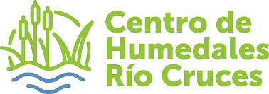
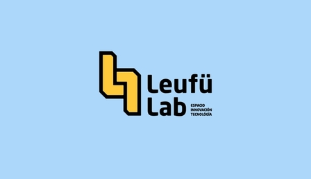
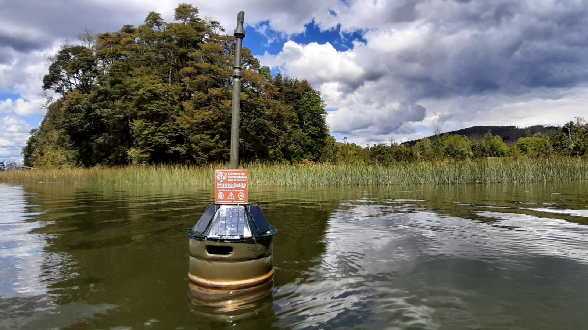
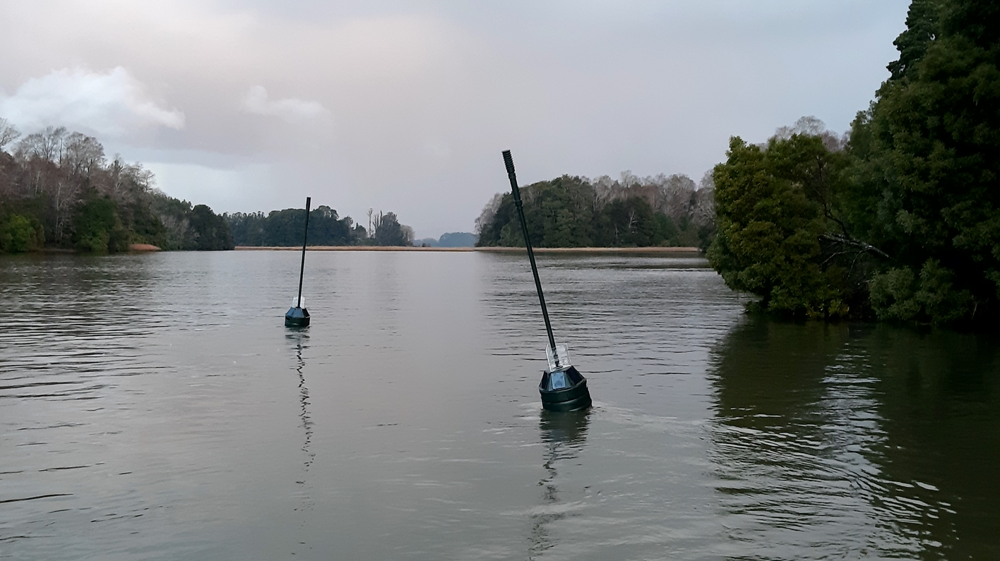

# Humedat@ — Smart Buoy for Real-Time, Cost-Effective Water Quality Monitoring

> Conceived and led by **[Cristián Correa, PhD](mailto:cristiancorrea@gmail.com)**, Marine Biologist and Ecologist at the [Centro de Humedales Río Cruces (CEHUM)](https://cehum.org/), in collaboration with the [LeufüLab Digital Fabrication Laboratory](https://leufulab.cl/) at Universidad Austral de Chile.  
> Software prototype developed by Course IIC2154 — Proyecto de Especialidad 2024, Pontificia Universidad Católica de Chile.  
> Licensed under [GPL-3.0](./LICENSE).


<p>
  
  
</p>

---

## What is Humedat@?

Humedat@ is an open, low-cost environmental monitoring system born in Valdivia, Chile, designed to continuously track water quality in wetlands and other aquatic ecosystems. Each Humedat@ unit is built around a repurposed stainless steel beer keg, housing waterproof sensors, microcontrollers, power systems, local storage, and wireless communication modules.





The system records environmental variables — such as water temperature, pH, electrical conductivity, dissolved oxygen, and oxidation-reduction potential — alongside internal device health indicators. Data are transmitted wirelessly from the field to cloud-based storage and made available through interactive web and mobile interfaces, in near real time.

Humedat@ was designed as a scalable platform: For example, CEHUM can deploy it across multiple organizations, each managing its own network of buoys grouped into **clusters** (e.g., by project or client) and **zones** (individual measurement sites, one buoy per zone). If a smart buoy requires maintenance and is swapped out, the software handles the transition transparently so that data series remain uninterrupted.

**Funding and support:** This project has been made possible through the backing of the [Centro de Humedales Río Cruces (CEHUM)](https://cehum.org/), the Pontificia Universidad Católica de Chile through its Capstone engineering course (IIC2154 — Proyecto de Especialidad 2024), the [Proyecto de Conservación Habitable Isla San Francisco](https://tfertil.cl/proyecto/isla-san-francisco/), and [Cerveza Kunstmann](https://www.cerveza-kunstmann.cl/).

---

## Repository Contents

This repository contains the full codebase and documentation for the Humedat@ system:

| Folder | Description |
|---|---|
| `manual_humedata/` | **Full technical manual** (hardware, firmware, cloud setup, calibration) |
| `Humedata-software/` | Web application (frontend + backend) and mobile app |
| `humedata_atlas/` | Arduino firmware for Atlas Scientific sensor buoys |
| `humedata_xian/` | Arduino firmware for Xi'an Desun sensor buoys |
| `TTN_payload_formatters/` | JavaScript decoders for LoRaWAN data packets (The Things Network) |
| `mqtt_subscriber/` | Service that receives data from TTN and writes it to the MySQL database |
| `data_storage/` | Database scripts and schema definitions |
| `printed_circuit_boards/` | PCB design files for the Humedat@ mainboard |
| `handle_sensors_test/` | Test code for individual sensor modules |
| `humedata_testing/` | Integration test scripts |
| `working_codes/` | Stable/reference versions of device firmware |
| `xian_gps_debug/` | GPS diagnostic utilities |

---

## How the System Works

Data flows through several layers from smart buoy to browser:

```
Sensors → Arduino (MKR WAN 1300) → LoRaWAN radio → Dragino Gateway
    → The Things Network (TTN) → MQTT subscriber → MySQL database
        → Backend API (AWS App Runner) → Web / Mobile App
```

1. **On the smart buoy:** An Arduino microcontroller reads sensors at configurable intervals (typically every 1–5 minutes) and packages the data into compact binary packets.
2. **Wireless transmission:** Data are sent via LoRaWAN radio to a Dragino gateway, which forwards them to The Things Network (TTN) over the internet (WiFi or cellular SIM card).
3. **Cloud ingestion:** A payload formatter in TTN decodes the binary packets into readable values. An MQTT subscriber service then writes the data into a MySQL database hosted on OpenCloud.
4. **Visualization:** A web application and companion mobile app allow users to explore and interact with the data — through maps, time-series charts, and downloadable CSV exports.

---

## Software Features

### Web Application
The web platform serves four user roles with progressively broader permissions:

- **Visitors** can explore maps and view sensor time-series charts without logging in.
- **Common users** (with an account) can also download data as CSV files.
- **Administrators** can annotate time series, mask/unmask data periods, apply mathematical corrections, derive new variables, and configure alarm triggers — for their own organization's buoys.
- **The super user** (CEHUM) can do all of the above across all organizations, and manage user accounts and organizational settings.

Key features include interactive maps, time-series visualization with smoothing and logarithmic scale options, customizable threshold regions for quick status interpretation, and zone-based data identification (so swapping a physical buoy is transparent to users).

### Mobile App
The companion app is designed for fieldwork:

- **Calibration module:** Connect to a smart buoy's Arduino via Bluetooth to read sensor output and upload calibration code — without needing a laptop in the field.
- **Map and data view:** Browse smart buoy locations, select a unit, and explore its data directly on a smartphone.
- **Offline support:** Partial offline functionality allows calibration in remote areas with limited connectivity.
- Compatible with both iOS and Android.

---

## Hardware Overview

Each Humedat@ smart buoy is built around:

- **Custom PCBs** hosting the Arduino MKR WAN 1300, with ports for Atlas Scientific sensors (I2C), Xi'an sensors (RS485), GPS, and internal environmental sensors.
- **MOSFET-based power circuits** for automatic daily resets, magnetic-switch resets (using a magnet on the outside of the keg), and GPS power management to extend battery life.
- **Atlas Scientific EZO modules** for water quality sensing (pH, dissolved oxygen, conductivity, ORP, temperature), and **Xi'an Desun** sensors as an alternative or complement.
- **Solar panels and batteries** for autonomous operation.
- **SD card** for local data backup in case of connectivity loss.
- **Dragino DLOS8N gateway** for LoRaWAN connectivity (via WiFi or a cellular SIM card).

PCB design files are available in the `printed_circuit_boards/` folder.

---

## Cloud Infrastructure used in different configurations include

| Component | Technology | Notes |
|---|---|---|
| Sensor database | MySQL on OpenCloud | Manually scalable |
| User database | MongoDB (shared tier) | Up to 5 GB free |
| Backend API | AWS App Runner | Auto-scales up to 25 instances |
| User authentication | Clerk | External identity provider |
| LoRaWAN network | The Things Network (TTN) | Australia 1 server (AU_915_928_FSB_2) |
| Legacy dashboards | Grafana | Being replaced by Humedat@-software |

All communications use HTTPS and encrypted credentials. The App Runner backend can handle up to 100 concurrent requests per instance.

---

## Getting Started

For full setup instructions — including PCB assembly, Arduino firmware upload, TTN gateway and end-device registration, MySQL database creation, backend deployment, and sensor calibration procedures — refer to the technical manual:

📄 [`manual_humedata/Humedata_Manual_Admin.docx`](./manual_humedata/Humedata_Manual_Admin.docx)

For developers contributing code:

1. **Fork** this repository and clone your fork locally (GitHub Desktop is recommended for those less familiar with the command line).
2. Work in your local copy, commit changes with clear messages, and push to your fork.
3. When ready, open a **Pull Request** to the main repository with a description of what you changed and why.

All meaningful changes to firmware, electronics, server configuration, SQL queries, calibration procedures, and documentation should be tracked in this repository to support traceability and long-term maintenance.

---

## Contributing

Contributions are welcome — whether you are fixing a bug, improving documentation, proposing new features, or porting the system to new hardware. Please use pull requests with a clear description of the problem addressed, the proposed solution, and any tests performed.

For questions or collaboration inquiries, contact: **Cristián Correa** — [cristiancorrea@gmail.com](mailto:cristiancorrea@gmail.com)

---

## License

This project is licensed under the **GNU General Public License v3.0**. See [`LICENSE`](./LICENSE) for details.
